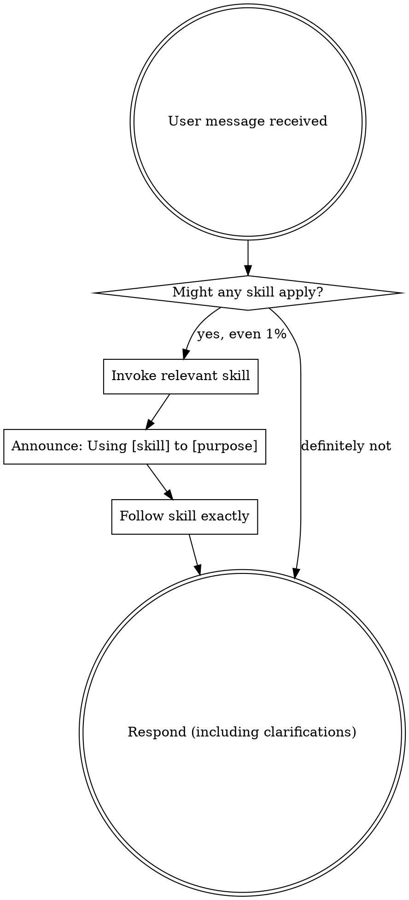

<SUBAGENT-STOP>
If dispatched as a subagent to execute a specific task, skip this skill.
</SUBAGENT-STOP>

<EXTREMELY-IMPORTANT>
If there is even a 1% chance a skill might apply to what you are doing, you ABSOLUTELY MUST invoke the skill.

IF A SKILL APPLIES TO YOUR TASK, YOU DO NOT HAVE A CHOICE. YOU MUST USE IT.
</EXTREMELY-IMPORTANT>

## Instruction Priority

Superpowers skills override default system prompt behavior, but **user instructions always take precedence**.

1. **User's explicit instructions** (CLAUDE.md, GEMINI.md, AGENTS.md, direct requests) — highest priority
2. **Superpowers skills** — override default system behavior where they conflict
3. **Default system prompt** — lowest priority

If AGENTS.md says "don't use TDD" and a skill says "always use TDD," follow the user's instructions. The user is in control.

## How to Access Skills

In Kilo Code: skills are loaded from `.kilo/skills/` or configured `skills.paths` in `kilo.jsonc`. When a skill applies, read and follow it directly.

# Using Skills

## The Rule

**Invoke relevant or requested skills BEFORE any response or action.** Even a 1% chance a skill might apply means you should invoke the skill to check. If an invoked skill turns out to be wrong for the situation, you don't need to use it.

## Red Flags

These thoughts mean STOP—you're rationalizing:

- "This is just a simple question" → Questions are tasks. Check for skills.
- "I need more context first" → Skill check comes BEFORE clarifying questions.
- "Let me explore the codebase first" → Skills tell you HOW to explore. Check first.
- "I can check files quickly" → Files lack conversation context. Check for skills.
- "Let me gather information first" → Skills tell you HOW to gather information.
- "This doesn't need a formal skill" → If a skill exists, use it.
- "I remember this skill" → Skills evolve. Read current version.
- "This doesn't count as a task" → Action = task. Check for skills.
- "I'll just do this one thing first" → Check BEFORE doing anything.

## Skill Priority

When multiple skills could apply:
1. **Process skills first** (brainstorming, debugging) - determine HOW to approach
2. **Implementation skills second** (design, building) - guide execution

## Skill Types

**Rigid** (TDD, debugging): Follow exactly. Don't adapt away discipline.
**Flexible** (patterns): Adapt principles to context. The skill itself specifies which.

## User Instructions

Instructions say WHAT, not HOW. "Add X" or "Fix Y" doesn't mean skip workflows.
