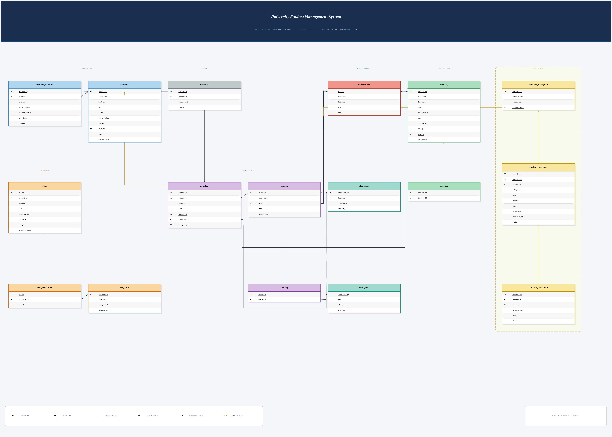

# Stitch Student Management System

[](https://www.mysql.com/)
[](https://www.php.net/)
[](#academic-tactility)

Stitch is a comprehensive, database-focused School Management System (SMS) designed for academic institutions. Built as part of the **CSE 425 - Database Management** course, it prioritizes robust database architecture, clean vanilla implementation, and a cutting-edge "Academic Tactility" neomorphic user interface.



## 🌟 Key Features

The system is organized into specialized modules designed to handle the complex workflows of a modern university:

-   **Comprehensive Dashboards**: Role-specific overviews for Administrators, Faculty, and Students featuring real-time statistics.
-   **Student Management**: Full lifecycle tracking from registration to graduation, including detailed profiles and enrollment history.
-   **Faculty Portal**: Management of academic staff, department assignments, and teaching schedules.
-   **Course & Section Catalog**: Dynamic management of course offerings, credits, and per-semester section scheduling.
-   **Enrollment System**: Intelligent student-to-section mapping with capacity validation and conflict detection.
-   **Attendance Tracking**: Daily, bulk-entry attendance recording with automated percentage calculations.
-   **Gradebook & Transcripts**: Weighted assessment tracking (quizzes, midterms, finals) and automated transcript generation.
-   **Notification Engine**: System-wide alerts for important academic updates and status changes.

---

## 🎨 Design Philosophy: "Academic Tactility"

Stitch breaks away from the sterile flatness of traditional administrative software by employing **Neomorphism (Soft UI)**. This "Academic Tactility" system creates a physically responsive interface that feels organic and reduces visual fatigue.

### Core Principles
-   **Dual Shadow Dynamics**: Using light and shadow (135° source) to create **Raised (Convex)** elements for interactivity and **Sunken (Concave)** elements for data input.
-   **Lexend Typography**: Utilizing the Lexend typeface, specifically engineered to improve reading proficiency and reduce visual stress during long administrative sessions.
-   **Physical Feedback**: Interactive elements provide tactile feedback by transitioning from raised to sunken states upon interaction.
-   **Softened Geometry**: A strict "no sharp corners" rule ensures a soft, molded aesthetic that feels premium and modern.

---

## 💻 Tech Stack

-   **Backend**: PHP 8.x (Vanilla)
-   **Database**: MySQL (InnoDB Engine, 3NF Normalization)
-   **Frontend**: HTML5, CSS3 (Custom Neomorphic Framework), Vanilla JavaScript
-   **Environment**: XAMPP / Apache

---

## 📂 Project Structure

```text
/
├── config/             # Database connection & PDO configuration
├── css/                # Neomorphic "Academic Tactility" stylesheets
├── includes/           # Reusable components (Header, Footer, Navbar, Auth)
├── js/                 # Vanilla JS utilities and component logic
├── modules/            # core functional modules
│   ├── attendance/     # Attendance tracking & reports
│   ├── auth/           # Secure login, logout, & registration
│   ├── courses/        # Catalog management
│   ├── dashboard/      # Statistics & role-based overviews
│   ├── enrollments/    # Student section mapping
│   ├── faculty/        # Staff management
│   ├── grades/         # Assessment & transcripts
│   └── students/       # Student records (CRUD)
├── stitch_student_management_system/ # UI Prototypes & Screen Mockups
└── university_er_diagram_v4.png      # Database Schema Documentation
```

---

## 🛠️ Installation & Setup

### Prerequisites
-   [XAMPP](https://www.apachefriends.org/index.html) or any PHP/MySQL environment.
-   PHP 8.0 or higher.

### Steps
1.  **Clone the Repository**:
    ```bash
    git clone https://github.com/noshinnawal119-bot/dbsm.git
    ```
2.  **Database Setup**:
    -   Open PHPMyAdmin.
    -   Create a new database named `university_sms`.
    -   Import the schema (located in `plan.md` or the dedicated SQL export file).
3.  **Configuration**:
    -   Update `config/database.php` with your local database credentials (host, username, password).
4.  **Run the Application**:
    -   Move the project to your server root (e.g., `htdocs`).
    -   Navigate to `http://localhost/dbsm` in your browser.

---

## 🔒 Security Standards

Stitch implements several layers of security to protect sensitive academic data:
-   **SQL Injection Protection**: Strict use of PDO prepared statements for all database interactions.
-   **Password Security**: Industry-standard `password_hash()` and `password_verify()`.
-   **Role-Based Access Control (RBAC)**: Middleware-enforced permissions for Admin, Faculty, and Student roles.
-   **XSS/CSRF Prevention**: Comprehensive input sanitization and token-based form protection.

---

## 🎓 Academic Context
This project was developed for **CSE 425 - Database Management**. It serves as a practical implementation of advanced database concepts, including normalization (3NF), referential integrity, complex joins, and secure data transaction management.

---

Developed with ❤️ for academic excellence.
